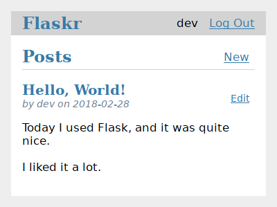

# Flaskr

<p align="center">
  
  
  
  
  
  
</p>

<p align="center">
  <a href="#rocket-technologies">Technologies</a>&nbsp;&nbsp;&nbsp;|&nbsp;&nbsp;&nbsp;
  <a href="#computer-project">Project</a>&nbsp;&nbsp;&nbsp;|&nbsp;&nbsp;&nbsp;
  <a href="#seat-getting-started">Getting started</a>&nbsp;&nbsp;&nbsp;|&nbsp;&nbsp;&nbsp;
  <a href="#thinking-how-to-contribute">How to contribute</a>&nbsp;&nbsp;&nbsp;|&nbsp;&nbsp;&nbsp;
  <a href="#memo-license">License</a>
</p>

<br>

<p align="center">
    
</p>

## :rocket: Technologies

This project was developed with the following technologies:

- [Python](https://nodejs.org)

Extras:

- Main Libs
  - [Flask](https://flask.palletsprojects.com)
- Style
  - [Black](https://black.readthedocs.io)
  - [EditorConfig](https://editorconfig.org)
  - [Flake8](https://flake8.pycqa.org)
  - [Pylint](https://pylint.org)

## :computer: Project

**Flaskr** is a basic blog application. Users will be able to register, log in, create posts, and edit or delete their own posts.

## :seat: Getting started

These instructions will get you a copy of the full project up and running on your local machine for development and testing purposes.

### Setting up the development environment

You will need to install [Git](https://git-scm.com) and [Python](https://www.python.org) before following the instructions below.

### Cloning project

```bash
git clone https://github.com/diegomais/flaskr.git
cd flaskr
```

### Creating a virtual environment

Use a virtual environment to manage the dependencies, both in development and in production.

What problem does a virtual environment solve? The more Python projects you have, the more likely it is that you need to work with different versions of Python libraries, or even Python itself. Newer versions of libraries for one project can break compatibility in another project.

Virtual environments are independent groups of Python libraries, one for each project. Packages installed for one project will not affect other projects or the operating system’s packages.

Python 3 comes bundled with the [venv](https://docs.python.org/3/library/venv.html#module-venv) module to create virtual environments. If you’re using a modern version of Python, you can continue on to the next section.

```bash
python3 -m venv .venv
```

Before you work on project, activate the corresponding environment:

```bash
. venv/bin/activate
```

### Install dependencies

Use the following command to install all dependencies:

```bash
pip install -r requirements.txt
pip install -r requirements-dev.txt
pip install -r requirements-test.txt
```

### Running the application

To run the application you can use the flask command:

```bash
flask run
```

You can now use the application at [http://localhost:5000](http://localhost:5000).

### Running the tests

To run the tests, use the `pytest` command. It will find and run all the test functions.

```bash
pytest
```

To measure the code coverage of tests, use the coverage command to run pytest instead of running it directly.

```bash
coverage run -m pytest
```

You can either view a simple coverage report in the terminal:

```bash
$ coverage report

Name                 Stmts   Miss Branch BrPart  Cover
------------------------------------------------------
flaskr/__init__.py      21      0      2      0   100%
flaskr/auth.py          54      0     22      0   100%
flaskr/blog.py          54      0     16      0   100%
flaskr/db.py            24      0      4      0   100%
------------------------------------------------------
TOTAL                  153      0     44      0   100%
```

An HTML report allows you to see which lines were covered in each file:

```bash
coverage html
```

This generates files in the htmlcov directory. Open htmlcov/index.html in your browser to see the report.

## :thinking: How to contribute

- Fork this repository;
- Create a branch with your feature: `git checkout -b my-feature`;
- Commit your changes: `git commit -m '[feat](scope) My new feature'`;
- Push to your branch: `git push origin my-feature`.

After the merge of your pull request is done, you can delete your branch.

## :memo: License

This project is under the MIT license. See the [LICENSE](LICENSE) for more details.

---

Made with :heart: by [Diego Mais](https://diegomais.github.io) :wave:.
